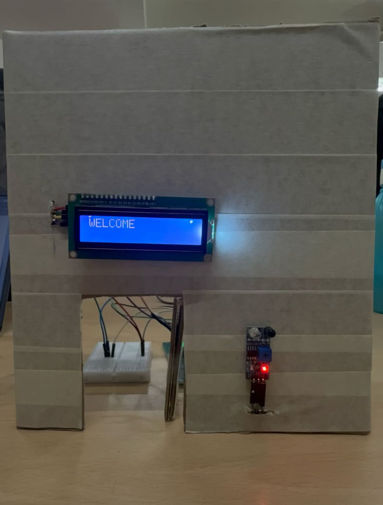
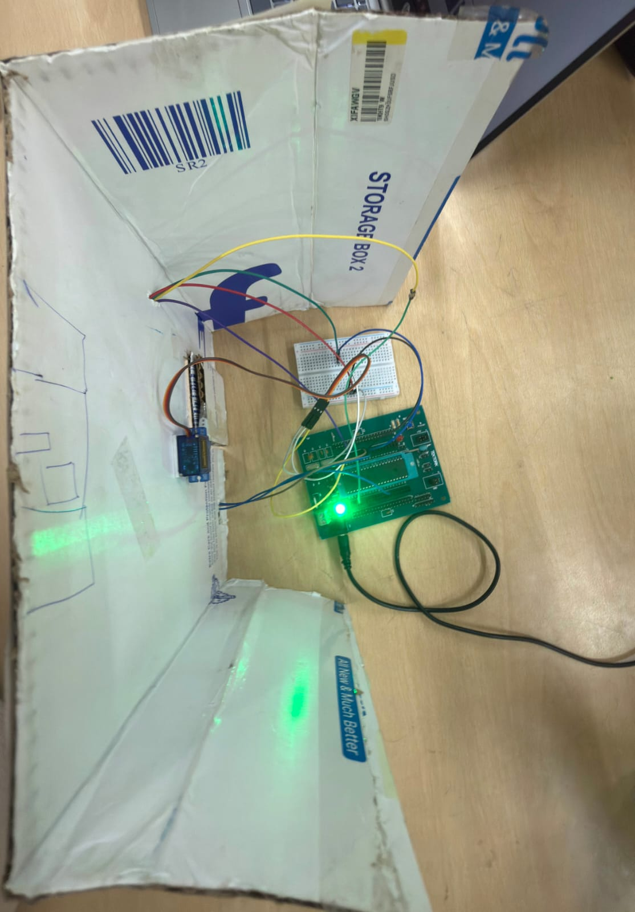

# Automatic Door System using PIC16F877A

An embedded systems project that implements an **automatic door control mechanism** using the **PIC16F877A microcontroller**, an **IR sensor** for object detection, a **servo motor** for door actuation, and a **16×2 LCD display** for user feedback. The system was designed, implemented, and tested on a **physical hardware prototype**.

---

## Overview

The project aims to provide a simple and efficient automatic door system that enhances convenience and demonstrates the practical application of microcontroller-based automation.

When a person approaches the entrance, the IR sensor detects their presence. The PIC16F877A processes this input and activates the servo motor to open the door. Simultaneously, a welcome message is displayed on the LCD screen. After a predefined delay, the servo returns to its original position, closing the door automatically.

---

## Features

* IR sensor-based object detection
* Automatic door opening using a servo motor
* Automatic door closing after a predefined delay
* Welcome message display using a 16×2 LCD module
* Embedded C implementation using MPLAB X IDE
* PIC16F877A microcontroller-based control system
* Physical prototype development and testing
* Real-time interaction between sensors, actuators, and display modules

---

## Prototype Demonstration

### Hardware Prototype



> The image above shows the working prototype of the automatic door system with the LCD displaying a welcome message.

### Circuit



> The image above shows the circuit of the automatic door system.

### Demonstration


> The video above shows the working demonstration of the automatic door system.

---

## System Workflow

```text
Person approaches the entrance
            ↓
IR sensor detects presence
            ↓
PIC16F877A receives sensor input
            ↓
Servo motor rotates to open the door
            ↓
LCD displays "WELCOME"
            ↓
Predefined delay
            ↓
Servo returns to initial position
            ↓
Door closes automatically
```

---

## Hardware Components Used

| Component                       | Purpose                             |
| ------------------------------- | ----------------------------------- |
| PIC16F877A Microcontroller      | Main control unit                   |
| IR Sensor Module                | Detects approaching objects/persons |
| Servo Motor                     | Controls door movement              |
| 16×2 LCD Display                | Displays system messages            |
| Breadboard and Connecting Wires | Circuit implementation              |
| External Power Supply           | Powers the system                   |

---

## Microcontroller Specifications

The project utilizes the **PIC16F877A**, an 8-bit RISC microcontroller featuring:

* 40-pin package
* 33 programmable I/O pins
* Operating voltage of 4V–5.5V
* Maximum clock frequency of 20 MHz
* Flash Program Memory: 8K words
* EEPROM Data Memory: 256 bytes
* Multiple timers for timing operations
* Built-in PWM support
* USART, SPI, and I²C communication capabilities

---

## Interfacing Details

### IR Sensor Module

| Connection | PIC16F877A |
| ---------- | ---------- |
| VCC        | +5V        |
| GND        | GND        |
| OUT        | RB0        |

### Servo Motor

| Connection  | PIC16F877A                         |
| ----------- | ---------------------------------- |
| Signal Wire | Control pin configured in firmware |
| VCC         | External +5V                       |
| GND         | Common Ground                      |

### LCD Display

| Connection  | PIC16F877A                                    |
| ----------- | --------------------------------------------- |
| SDA/Data    | Connected according to project implementation |
| SCL/Control | Connected according to project implementation |
| VCC         | +5V                                           |
| GND         | Common Ground                                 |

---

## Software Tools Used

* MPLAB X IDE
* Embedded C
* PIC Compiler (XC8 or project-specific compiler)

---

## Project Structure

```text
Automatic-Door-System-PIC16F877A/
│
├── README.md
│
├── firmware/
│   └── AutomaticDoorSystem.X/
│       ├── main.c
│       ├── Makefile
│       └── nbproject/
│
├── images/
│   ├── open.jpg
│   ├── close.jpg
│   └── circuit.jpg
│
├── videos/
│   └── demo.mp4
│
└── presentation/
    └── Automatic_door_system.pptx
```

---

## How the System Works

1. The IR sensor continuously monitors the entrance area.
2. When an object is detected, the sensor output changes state.
3. The PIC16F877A reads this signal through its input pin.
4. The microcontroller generates the appropriate control signal for the servo motor.
5. The servo rotates, opening the door.
6. The LCD displays a welcome message to the user.
7. After a preset time interval, the servo returns to its initial position, closing the door.

---

## Applications

* Shopping malls
* Hospitals and healthcare facilities
* Office buildings
* Educational institutions
* Smart home systems
* Public access control systems

---

## Advantages

* Hands-free operation
* Improved user convenience
* Demonstrates embedded automation concepts
* Low-cost implementation
* Expandable for future enhancements
* Integrates sensing, processing, actuation, and user feedback

---

## Future Improvements

Potential enhancements include:

* Password or RFID-based authentication
* Ultrasonic sensor integration
* IoT-based remote monitoring and control
* Obstacle detection for improved safety
* Energy-efficient operation modes
* Mobile application integration

---

## Documentation

A detailed presentation describing the project objectives, hardware interfacing, control flow, applications, and implementation methodology is included in this repository.

Presentation file:

```text
presentation/Automatic_door_system.pptx
```

---

## Educational Outcomes

This project provided practical experience in:

* Embedded C programming
* PIC microcontroller interfacing
* Sensor integration techniques
* Servo motor control
* LCD communication
* Hardware prototyping and testing
* Embedded system design methodologies

---

## Conclusion

The Automatic Door System successfully demonstrates the integration of sensing, decision-making, actuation, and user interaction using embedded systems technology. By combining an IR sensor, PIC16F877A microcontroller, servo motor, and LCD display into a working prototype, the project showcases the practical application of automation principles in real-world scenarios.

